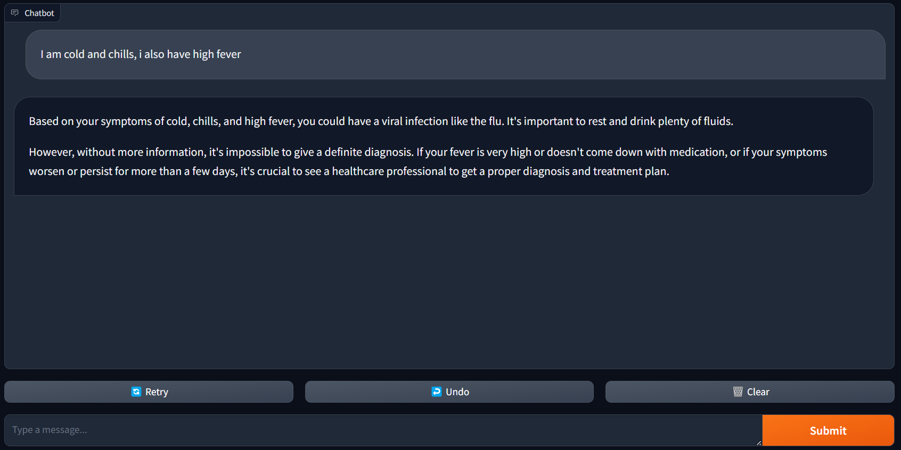
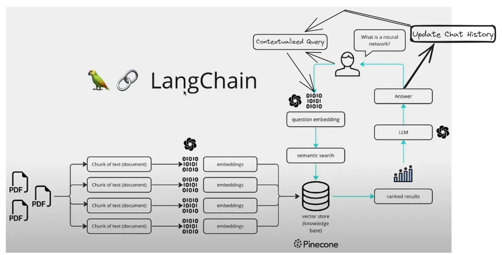

# Healthcare Diagnosis Chatbot

Welcome to my repository for the **MS Hackathon 2024** submission!

## Problem Statement

Create a chatbot capable of diagnosing common medical conditions based on user-input symptoms. The chatbot should use machine learning models trained on medical data to provide accurate suggestions and recommendations for further action.

## Solution Overview

I've built a chatbot using **Large Language Models (LLMs)** and the **Langchain** framework. The chatbot takes symptoms as input from the user and provides a diagnosis based on this input. **It can ask follow-up questions** to gather more information if needed and offers recommendations for further action, such as seeing a doctor or getting tests done. The chatbot fetches answers from credible sources (books on Medicine, Pediatrics, and Dermatology) containing common diseases and their symptoms. The user interface is created using **Gradio** and the data is stored and retrieved using **Pinecone**. Answers are formulated using the **Gemini-API** due to its free and user-friendly nature.

## Project Setup

Follow these steps to set up the project locally:

1. **Clone the repository and navigate to the project directory:**
    ```bash
    git clone https://github.com/Vineet-the-git/Medical-Chatbot.git
    cd Medical-Chatbot
    ```
2. **Create a virtual environment using conda:**
    ```bash
    conda create -n chatbot python=3.10
    conda activate chatbot
    ```

3. **Install the required dependencies:**
    ```bash
    pip install -r requirements.txt
    ```

4. **Start the chatbot:**
    ```bash
    python app.py
    ```

5. **Access the chatbot:**
    Open your browser and navigate to `http://localhost:{port}/`, where `{port}` is the port number shown in the terminal (e.g., `http://127.0.0.1:7860`).

6. **Stop the server:**
    Press `Ctrl+C` in the terminal.

For a visual guide on setting up the project, you can watch [this video](https://www.youtube.com/watch?v=Q6J9Q1Q1Z1M).

## Using the Chatbot



1. **Enter symptoms:**
    Type the symptoms in the text box and click the `Submit` button.
2. **Receive diagnosis:**
    The chatbot will respond with a diagnosis based on the entered symptoms.
3. **Button Functions:**
    - `Clear`: Clears the chat history and starts a new conversation.
    - `Undo`: Removes the last user message and its response from the chat history.
    - `Retry`: Retries the last message sent by the user.

For a demonstration, check out [this video](https://www.youtube.com/watch?v=Q6J9Q1Q1Z1M).

## Solution Workflow



## Running the Project on Your Own Data

1. **Add your data:**
    Place your data in the `data` folder.
2. **Create a Pinecone index:**
    Add your Pinecone API key to the `config/config.yaml` file and load your data to the index:
    ```bash
    python store_to_index.py
    ```
3. **Set up Gemini-API:**
    Create an account and add your API key to the `config/config.yaml` file.
4. **Start the chatbot:**
    ```bash
    python app.py
    ```
5. **Access the chatbot:**
    Open your browser and navigate to `http://localhost:{port}/`.

## Future Improvements

- [x] Try different prompts to improve robustness.
- [x] Add instructions to run the project.
- [x] Document the code and approach.
- [x] Explore local LLMs to reduce latency.

## References

- [Langchain Documentation](https://docs.langchain.com/)
- [Gradio Documentation](https://gradio.app/docs)
- [Pinecone Documentation](https://www.pinecone.io/docs/)
- [Gemini-API Documentation](https://geminiapi.com/docs/)
- [Hugging Face Transformers Documentation](https://huggingface.co/transformers/)

Thank you for checking out my project! If you have any questions or suggestions, feel free to open an issue or contact me.